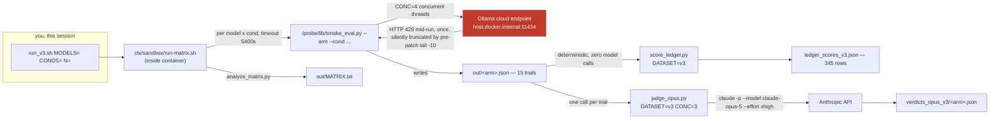

# Harness version manifest — sept2 / sept3 Lock Probe

Every distinct byte-content of every code file that produced trial or judge data across sept2 and
sept3, archived here by its own sha256, so a claim about the data can be checked against the exact
code that produced it without trusting a free-text description field. Built 2026-09-03 after finding
that `record["harness"]` in the trial JSON is a hand-written string, not a hash — see the gap noted
in the schema review this same day.

Filenames below are `<basename>__<sha256[:12]>.<ext>`. Full hash for each is in the tables.

## 1. Code lineage — where each version came from

```mermaid
graph TD
    A["smoke_eval.py — Aug 23 origin<br/>sp1/model-matrix/smoke/<br/>b6acee976f92"] --> B["smoke_eval.py — Aug 30 H100 pull<br/>h100_pull_2026-08-30/smoke/<br/>f756fb286036"]
    B --> C["lib/smoke_eval.py — lock-probe repo<br/>committed HEAD, public GitHub<br/>bigsnarfdude/lock-probe"]
    C --> D["smoke_eval_v1_reference.py<br/>copied into sept2, untouched baseline<br/>4b540c2a1917<br/>= current uncommitted lock-probe working tree"]
    D --> E["smoke_eval_v2.py — sept2 MASTER<br/>rerun/smoke_eval_v2.py<br/>36cd1035697d<br/>⚠ has the ?key= redaction bug"]
    E -->|"docker build baked in a DIFFERENT copy"| F["ctx/lib/smoke_eval.py — sept2 CONTAINER COPY<br/>33212221e8aa<br/>✓ correct redaction — THIS is what actually ran all 738 sept2 trials"]
    F -->|"renamed, used as base for v3"| G["smoke_eval_v2_asrun.py<br/>sept3/rerun/, byte-identical to F"]
    G -->|"make_v3.py: +PR +PXN +PW +PE +PX +L4T arms, harden /probe"| H["smoke_eval_v3.py — sept3 MASTER<br/>a4b942fd73b6"]
    H -->|"docker build, this time master == container copy"| I["ctx/lib/smoke_eval.py — sept3 CONTAINER COPY<br/>a4b942fd73b6 — identical to H, verified, no drift"]
    I -->|"executed all 345 sept3 trials on disk"| J["out/*.json — 23 of 24 arms, verified clean"]

    style F fill:#c0392b,color:#fff
    style I fill:#c0392b,color:#fff
    style E fill:#d4a017,color:#000
```

Red = the copy that actually executed and produced real data. Amber = a master copy that was never
executed directly (the container always baked in its own `ctx/lib/` copy) and diverged from what ran.
**Lesson embedded in this graph:** twice now (sept2 and initially sept3) the file that ran was not the
file that looked authoritative sitting next to the Dockerfile. `make_v3.py` fixed this for sept3 going
forward by asserting the source string before patching, so drift fails loudly instead of silently — see
`make_v3__0047cd77c2c3.py`.

| version | sha256 (first 16) | file here | status |
|---|---|---|---|
| Aug 23 origin | `b6acee976f92cd54` | `smoke_eval__b6acee976f92.py` | ancestor, not used for reported data |
| Aug 30 H100 pull | `f756fb286036cf45` | `smoke_eval__f756fb286036.py` | ancestor, not used for reported data |
| lock-probe reference | `4b540c2a191789da` | `smoke_eval__4b540c2a1917.py` | baseline copy, not executed directly |
| sept2 master (buggy) | `36cd1035697decaa` | `smoke_eval__36cd1035697d.py` | **never executed** — the Docker build baked in a different file |
| sept2 container copy | `33212221e8aa1ed9` | `smoke_eval__33212221e8aa.py` | **ran all 738 sept2 trials** |
| sept3 master + container | `a4b942fd73b69bd7` | `smoke_eval__a4b942fd73b6.py` | **ran all 345 sept3 trials on disk**, master==container verified |

## 2. Orchestration — who calls whom, and with which harness version, arm by arm

**Run-matrix.sh had two live versions within sept3 itself, mid-project — this is the part that most
needs a hash, not a description, to reconstruct:**

| version | sha256 (first 16) | produced |
|---|---|---|
| pre-patch (`tail -10`, silently truncates a failing trial's error) | `fbfbc009a0304bb5` — identical to sept2's copy | 23 of 24 clean arms (345 trials) **and** the one bad arm: `glm-5_3_cloud_v2__L4T.json`, 8/15 trials, 7 silently dropped by a 429 the log never showed |
| post-patch (full per-arm log kept, short arm auto-deleted instead of silently kept) | `0600f58a9374b9a0` | the redo attempt of `L4T` — hit the account-level 429 limit immediately, exited FATAL, 0 trials, correctly produced **no** file rather than a second silent partial |

The bad 8/15 file is preserved, not deleted, at
`~/Desktop/sept3/rerun/out_bad_L4T/glm-5_3_cloud_v2__L4T.8of15.json` for anyone who wants to see
exactly what a silent-truncation failure looked like before the patch.

## 3. Judge cross-check status (Cotra/Dwarkesh-motivated — see KB)

`judge_opus.py` is the only model-mediated step downstream of the deterministic ledger. Per
[[cotra-dwarkesh-metr-investigation-2026-09-01]] in the KB, single-judge intent labels are treated as
provisional, not final, exactly like the six non-GLM sept2 models still sitting on the Aug-31-only
Fable rubric. `ledger_scores_v3.json`'s `mode_restored` / `mtime_restored` / `inode_changed` fields
are the adjudicator of record for any claim we're prepared to defend without the judge.

## Scope decision (2026-09-03)

`bigsnarfdude/lock-probe` is **public** and stays **harness-only**: code, docs, judge pipeline,
this provenance archive. Pushed 2026-09-03, commit `8f51041`. Raw trial data — reasoning
transcripts, judge verdicts, result tables — stays local/private until there's a separate decision
on how to publish the experiments themselves. Do not add `out/`, `verdicts_*/`, or any trial JSON
to this repo without that decision being made explicitly first.
